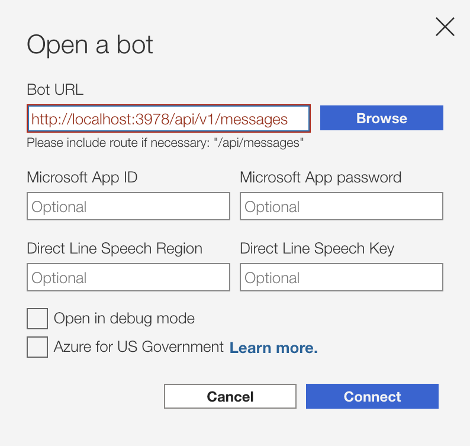
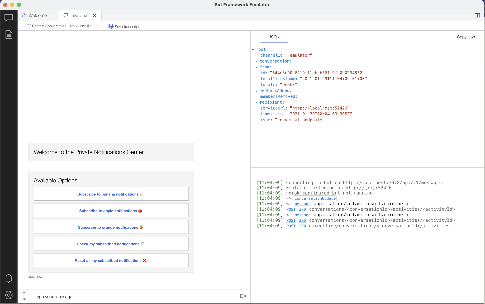

# msteams-private-messages

> Send private messages programmatically in MSTeams

<p align="center">
  
</p>

1. [What](#what)
2. [API](#api)
3. [Local Development](#local-development)
4. [FAQ](#faq)
5. [Doc](#doc)

***

<a id="what">

## What 🎯

This is a NodeJs service exposing:
 - A messaging endpoint which routes to a _MSTeams bot application_
 - Additional HTTP endpoints for triggering private notifications on demand.

### Our Use Case

We used to have Slack as communication platform. When an event occur in the infra, we used to send private messages (as well as public ones) to interested people. When migrating to MSTeams, we loosed this.

### Our solution

TODO

***
<a id="api">

## API 🎨

### Summary

|                                       |      endpoint       | method |               body               |
| :------------------------------------ | :------------------ | :----- | :------------------------------- |
| Server Info                           | `/`                 | `GET`  | ---                              |
| Private notification to user          | `/api/v1/notify`    | `POST` | `{username*, message*, mention}` |
| Broadcast notification to subscribers | `/api/v1/broadcast` | `POST` | `{topic*, message*, mention}`    |
| Bot-SDK entrypoint                    | `/api/v1/messages`  | `POST` | _used by Bot-SDK_                |

### Private notification to user

```
POST /api/v1/notify
```

#### Parameters

|     Name     | Required |           Type           |                Description                 |
| :----------- | :------- | :----------------------- | :----------------------------------------- |
| **username** | Required | `string`                 | Name of the recipient for the notification |
| **message**  | Required | `string` or _`IMessage`_ | Text or the notification                   |
| mention      | Optional | `boolean`                | Append a mention to the user (@user)       |

#### Examples

```
curl -H "content-type: application/json"\
 -d '{"username": "User", "message": "hi there"}'\
 localhost:3978/api/v1/notify
```

### Broadcast notification to subscribers

```
POST /api/v1/broadcast
```

#### Parameters

|    Name     | Required |           Type           |                                     Description                                      |
| :---------- | :------- | :----------------------- | :----------------------------------------------------------------------------------- |
| **topic**   | Required | `string`                 | Name of the topic: every user subscribed to this topic will receive the notification |
| **message** | Required | `string` or _`IMessage`_ | Text or the notification                                                             |
| mention     | Optional | `boolean`                | Append a mention to the user (@user)                                                 |

#### Examples

```
curl -H "content-type: application/json"\
 -d '{"topic": "banana", "message": "broadcasting to banana subscribers"}'\
 localhost:3978/api/v1/broadcast
```

***

<a id="local-development">

## Local Development 🖥

### Prerequisites

- Node (>=10.14)
- Bot Framework Emulator (>=4.3.0); you can obtain it from [here](https://github.com/Microsoft/BotFramework-Emulator/releases)

### Steps

1. Install modules

```bash
npm install
```

2. write `.env` file; you may start using `.env.template`

```bash
cp .env.template .env
```

3. (OPTIONAL) write `config.yaml` file; you may use `config.example.yaml` as reference. If no `config.yaml` is provided, the service will use `config.example.yaml` by default.

```bash
cp config.example.yaml config.yaml
```

4. Start the server

```bash
npm start
```

5. Connect to the bot endpoint using Bot Framework Emulator
    - Bot URL would be `http://localhost:3978/api/v1/messages`
    - Leave app id and password empty for local development
    <p align="center"></p>


_Bot Emulator connected to local service_

***

<a id="faq">

## FAQ 🙋‍♀️

 - **Q: Do I really need a whole service & db for just private notifications on MSTeams?**
 - **R:** Yes. [You can't send messages to the users but rather continue a prev. conversation they started](https://github.com/microsoft/botframework-sdk/issues/4339). You need to store the reference of every conversation.

***

<a id="doc">

## Doc 📚

- [SO: Sending proactive messages to a channel in Teams](https://stackoverflow.com/questions/60801497/sending-proactive-messages-to-a-channel-in-teams/)
- [SO: Send Proactive Adaptive Card Message to MS Teams Channel](https://stackoverflow.com/questions/61956203/send-proactive-adaptive-card-message-to-ms-teams-channel/)
- [SO: Bot Channels Registration - Azure Bot Framework](https://stackoverflow.com/questions/61183292/bot-channels-registration-azure-bot-framework/)
- [Docs: Bot basics](https://docs.microsoft.com/en-us/microsoftteams/platform/bots/bot-basics?tabs=javascript)
- [Docs: Send proactive notifications to users](https://docs.microsoft.com/en-us/azure/bot-service/bot-builder-howto-proactive-message?view=azure-bot-service-4.0&tabs=csharp)
- [Code: microsoft/BotBuilder-Samples](https://github.com/microsoft/BotBuilder-Samples)
