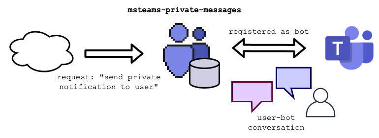
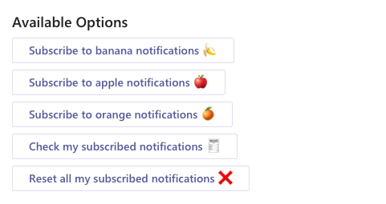
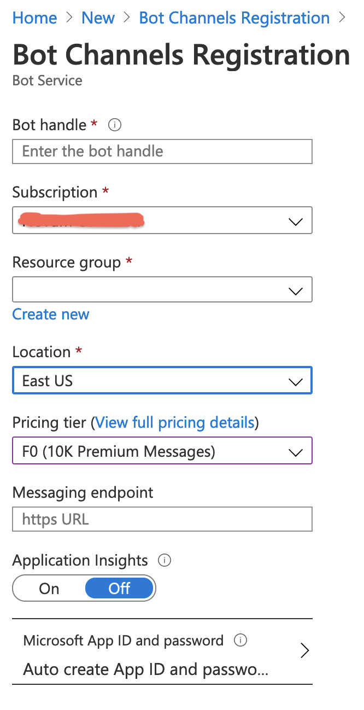
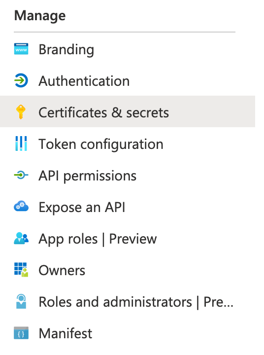
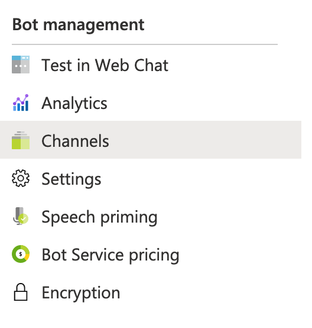
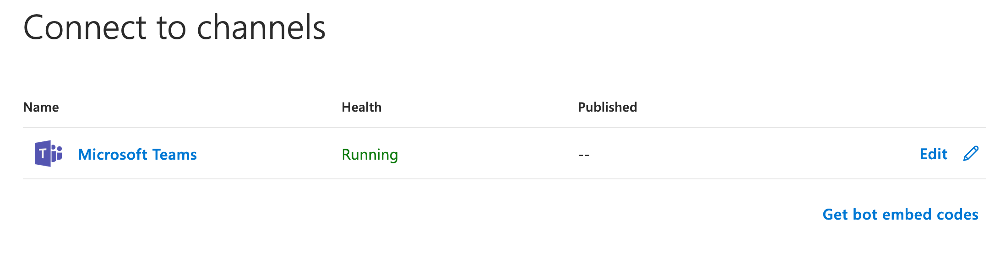

<p align="right">
  <a href="https://github.com/semantic-release/semantic-release"></a>
</p>

# msteams-private-messages

> Send private messages programmatically in MSTeams

<p align="center">
  
</p>

This is a NodeJs service exposing:

- A messaging endpoint which routes to a [MSTeams bot application](https://docs.microsoft.com/en-us/microsoftteams/platform/bots/what-are-bots)
- Additional HTTP endpoints for triggering private notifications to users on demand.

---

**Table of contents**

1. [Our Use Case 🎯](#our-use-case)
2. [API 🎨](doc/api.md)
3. [Configuration 🏗](#configuration)
4. [Azure ☁️](#azure)
5. [Local Development 🖥](local-development/README.md)
6. [Upload to Teams 🚀](#upload-to-teams)
7. [FAQ 🙋‍♀️](#faq)
8. [Additional Doc 📚](#doc)

---

<a id="our-use-case">

## Our Use Case 🎯

We used to have Slack as communication platform. When an event occur in our infra, we used to send private messages (as well as public ones) to interested people. When migrating to MSTeams, we loosed this.

### Our solution



We've implemented a MSTeams Bot that allows us to interact with users through text and cards while exposing a regular HTTP API.

- `msteams-private-messages` is a web service.
- This web service is registered on Azure as a [Bot Channel](https://docs.microsoft.com/en-us/azure/bot-service/bot-service-quickstart-registration?view=azure-bot-service-4.0)
- As conversational bot, when a user starts a conversation, the service saves a reference to that conversation as well as the name of the user.
- The bot offers the user a menu of topics to subscribe, if the user subscribes to any of those, the service saves the relation `user-topics`.
- The web service exposes a regular API able to:
  1. `notify` a message to an specific user (we need that user to have started a conversation with the bot in first place)
  2. `broadcast` a message related to a topic to every user subscribed to the topic

---

<a id="configuration" />

## Configuration 🏗

### `.env`

`.env` file is read on startup (no hot loading).

A `.env.template` file is provided, you may use it as reference:

```bash
cp .env.template .env
````

| env var                  | default value | usage                                                                |
| :----------------------- | :------------ | :------------------------------------------------------------------- |
| `LOCAL`                  | `false`       | flag: connect to a running BotApp on Azure or local development      |
| `MICROSOFT_APP_ID`       | `undefined`   | ClientId registered at Azure's ADD (**app id**) - apply if `!LOCAL`  |
| `MICROSOFT_APP_PASSWORD` | `undefined`   | SecretId registered at Azure's ADD (**app key**) - apply if `!LOCAL` |
| `PORT`                   | 3978          | listening port on startup                                            |
| `LOG_LEVEL`              | info          | logging level (debug, info, warn...)                                 |

**tip:** a minimal `.env` file for production may looks like:

```dotenv
MICROSOFT_APP_ID=xxxxxxxx-xxxx-xxxx-xxxx-xxxxxxxxxxxx
MICROSOFT_APP_PASSWORD=xxxxxxxxxxxxxxxxxxxxxxxxxxxxxxxxxx
```

### Bot Cards

The cards that the bot sends as well as the available options to subscribe are configurable via `.yaml` file. `config.yaml` file is read on startup (no hot loading implemented).

An example file is provided at the root folder, just change the `title` & `value` strings to fit your needs.</br>
Note: If no `config.yaml` is provided, the service will use `config.example.yaml` by default.

```bash
cp config.example.yaml config.yaml
```

**Welcome message: `welcomeCard`**

```yaml
cards:
  [...]
  welcomeCard:
    title: Welcome to the Private Notifications Center
    text: ""
```

**Unknown command: `unknownCard`**

```yaml
cards:
  [...]
  unknownCard:
    title: ""
    text: Unknown command...
```

**Topics: `menuCard`**

As we mentioned, the bot offers the user a menu of topics to subscribe. On broadcast requests (`/api/v1/broadcast`), this service will check who is subscribed to the desired topic.

```yaml
cards:
  [...]
  menuCard:
    title: Available Options
    checkButton:
      title: Check my subscribed notifications 🧾
      value: check
    resetButton:
      title: Reset all my subscribed notifications ❌
      value: reset
    subscriptionButtons:
      - title: Subscribe to banana notifications 🍌
        value: banana
      - title: Subscribe to apple notifications 🍎
        value: apple
      - title: Subscribe to orange notifications 🍊
        value: orange
```

This `.yaml` file would render as:



---

<a id="azure">

## Azure ☁️

This section aims to be a quick summary of which are the minimal needs to have a bot application (Azure App registration) connected to an external web service.

`msteams-private-messages` is, essentially, a server that can receive and send JSON. We'll need to register our service as a "Bot Channel" on Azure.

**Note**: It's possible to host also the service on Azure. There is [official documentation regarding 'how to deploy'](https://docs.microsoft.com/en-us/azure/bot-service/bot-builder-deploy-az-cli?view=azure-bot-service-4.0&tabs=javascript). In our case we're hosting the web service in our own platform, keeping the interaction with Azure to the minimum.

We'll need a few resources from the [Azure portal](https://portal.azure.com/#home)

1. **Resource group**.
   - Whatever you want to name it.
2. **Bot Channel Registration**.
   - Bot handle: internal naming. Can't be changed after creation. Won't be displayed when proper naming is set.
   - Messaging endpoint: the web address of the `msteams-private-messages` service. Can be changed after creation. Will look like:
     ```
     https://{domain}/api/v1/messages
     ```
     
3. Go to the settings of your **Bot Channel Registration**
   - Select "Settings": 
   - Copy the **Microsoft App ID** value (the one that can't be changed)
   - Click "Manage", then "Certificate & secrets": 
   - Create a "New client secret" and copy its value (you won't see it again). This will be our **Microsoft App Secret**
4. Go back to the settings of your **Bot Channel Registration**
   - Select "Channels": 
   - Connect to Microsoft Teams channel. It should say "Running" 

### Remote Connection

We've ended up with 2 values: **Microsoft App Id** & **Microsoft App Secret**.</br>
Copy those values in your `.env` file for enabling remote connection.

```dotenv
LOCAL=false
MICROSOFT_APP_ID=xxxxxxxx-xxxx-xxxx-xxxx-xxxxxxxxxxxx
MICROSOFT_APP_PASSWORD=xxxxxxxxxxxxxxxxxxxxxxxxxxxxxxxxxx
```


---

<a id="upload-to-teams">

## Upload to Teams 🚀

TODO

---

<a id="faq">

## FAQ 🙋‍♀️

**Q: Do I really need a whole service & db for just private notifications on MSTeams?**<br/>
**A:** Yes. [You can't send messages to the users but rather continue a prev. conversation they started](https://github.com/microsoft/botframework-sdk/issues/4339). You need to store the reference of every conversation.

**Q: I've tried to mention the user on Bot Framework Emulator and it doesn't work**</br>
**A:** We know. Appending a mention does work on Microsoft Teams but won't render on the Emulator. Probably this is a issue related to the Emulator itself.

**Q: Getting 401 error all the time. Already checked my Azure App ID + pass**
```bash
Error: BotFrameworkAdapter.processActivity(): 401 ERROR
 Error: Unauthorized. Invalid AppId passed on token: <YOUR APP ID>
```
**A:** Assuming you've provided correct credentials (ID + pass), check that you aren't launching the server using `LOCAL` mode (you wouldn't believe how many times this happened to me)
```dotenv
LOCAL=false
```

**Q: Why the pixeled icon?**</br>
**A:** One of the devs thought it was cool.

---

<a id="doc">

## Additional Doc 📚

- [SO: Sending proactive messages to a channel in Teams](https://stackoverflow.com/questions/60801497/sending-proactive-messages-to-a-channel-in-teams/)
- [SO: Send Proactive Adaptive Card Message to MS Teams Channel](https://stackoverflow.com/questions/61956203/send-proactive-adaptive-card-message-to-ms-teams-channel/)
- [SO: Bot Channels Registration - Azure Bot Framework](https://stackoverflow.com/questions/61183292/bot-channels-registration-azure-bot-framework/)
- [Docs: Bot basics](https://docs.microsoft.com/en-us/microsoftteams/platform/bots/bot-basics?tabs=javascript)
- [Docs: Send proactive notifications to users](https://docs.microsoft.com/en-us/azure/bot-service/bot-builder-howto-proactive-message?view=azure-bot-service-4.0&tabs=csharp)
- [Docs: Bot channels registration](https://docs.microsoft.com/en-us/azure/bot-service/bot-service-quickstart-registration?view=azure-bot-service-4.0)
- [Code: microsoft/BotBuilder-Samples](https://github.com/microsoft/BotBuilder-Samples)
- [Post: Sequelize relationships - Ultimate guide](https://medium.com/@eth3rnit3/sequelize-relationships-ultimate-guide-f26801a75554)
