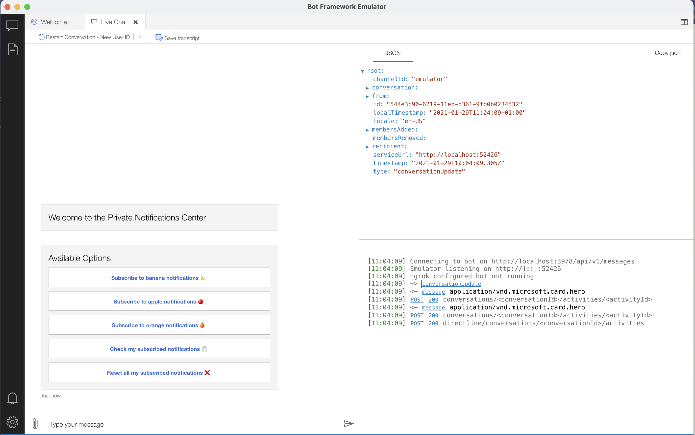
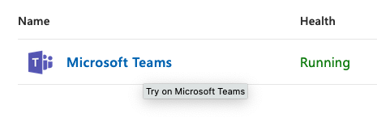

# Local Development 🖥


**Prerequisites**

- Node (>=10.14)
- Docker
- Bot Framework Emulator (>=4.3.0); you can obtain it from [here](https://github.com/Microsoft/BotFramework-Emulator/releases)

1. Install modules

```bash
npm install
```

2. write `.env` file; you may start using `.env.template` for local development

```bash
cp .env.template .env
```

3. (OPTIONAL) write `config.yaml` file; you may use `config.example.yaml` as reference.

```bash
cp config.example.yaml config.yaml
```

4. Configure the mysql database
```
cd local-development
docker-compose up -d
mysql -h 127.0.0.1 -u root -e "create database msteamsbot;"
npx sequelize-cli db:migrate
```

5. Start the database and server

```bash
docker-compose up -d
```

### Run on the Emulator

5. Connect to the bot endpoint using Bot Framework Emulator
   - add "172.17.0.1" to the setting "localhost override" in the Emulator
   - Bot URL would be `http://localhost:3978/api/v1/messages`
   - Leave app id and password empty for local development


_Bot Emulator connected to local service_

### Run on Teams app

**prerequisites**

- [`ngrok`](https://ngrok.com/) or equivalent tunneling solution
- [M365 developer account](https://docs.microsoft.com/en-us/microsoftteams/platform/concepts/build-and-test/prepare-your-o365-tenant) or access to a Teams account with the appropriate permissions to install an app.

1. `ngrok`: Your app will be run from a localhost server. You will need to setup `ngrok` in order to tunnel from the Teams client to localhost.</br>
   Run `ngrok` point to port 3978:

```bash
ngrok http -host-header=rewrite 3978
```

You may test that everything is up requesting server info:

```bash
 $» curl -s https://{subdomain}.ngrok.io/ | jq
"msteams-private-messages@x.y.z"
```

2. Make sure you've checked the [Azure ☁️ ](#azure) section. At settings, change the **Messaging endpoint** pointing to your `ngrok` subdomain

```
Messaging endpoint:
https://{subdomain}.ngrok.io/api/v1/messages
```

3. Click on **Channels**, then click on **Try on Microsoft Teams**
   
